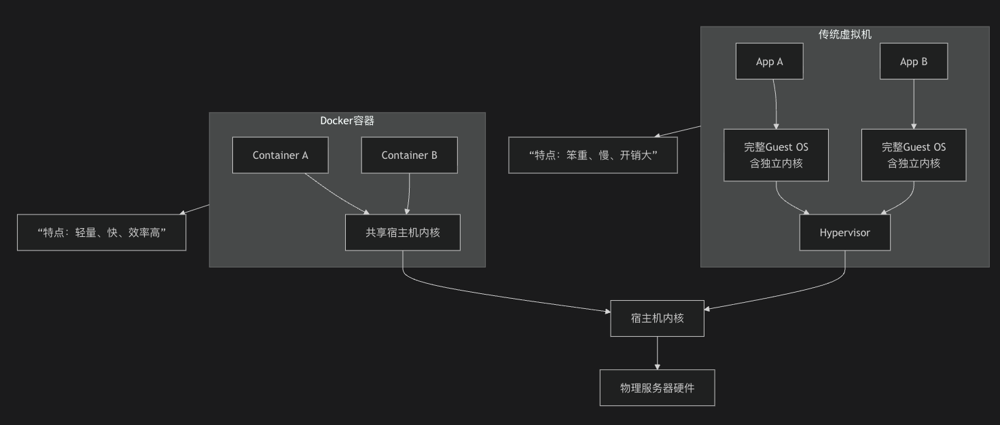
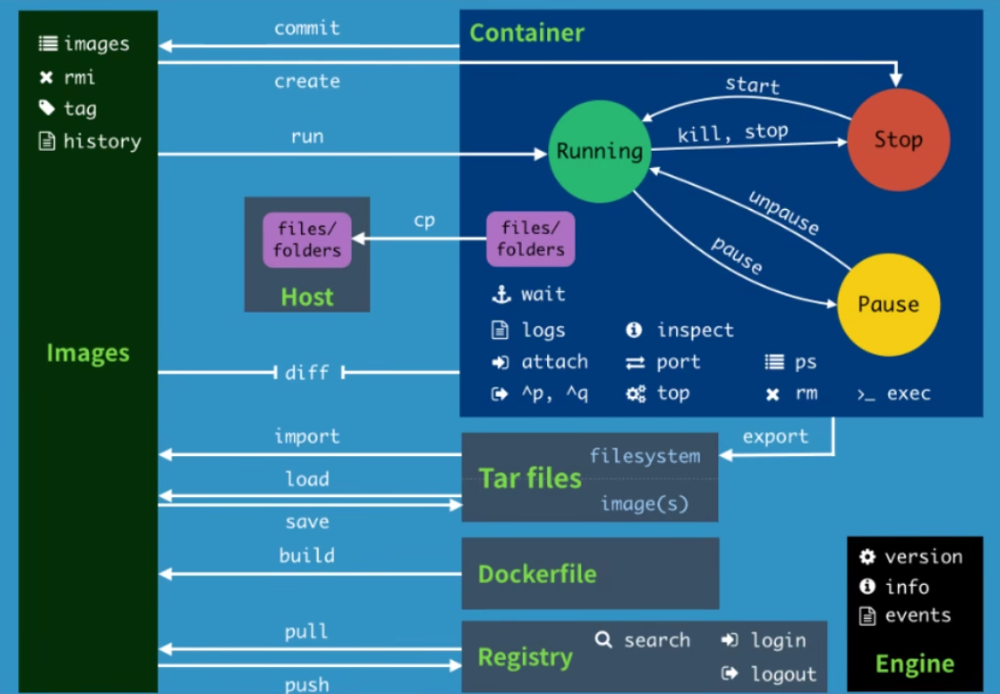

____
## 学习文档
```java
视频：
https://www.bilibili.com/video/BV1og4y1q7M4?t=28.7
官网：
https://www.docker.com/
命令：
https://docs.docker.com/reference/
仓库：
https://hub.docker.com
```

## 基础
### 1.出现背景
1. 2010年，创始人在法国成立了dotCloud公司，主营PaaS云计算服务，公司将自己的Linux容器技术（LXC）命名为Docker。2013年3月，为了生存，进行Docker开源。2014年4月9日，Docker1.0发布。
2. 核心里面是集装箱思想，像集装箱一样将货物和所需环境（如制冷）统一打包，在任何港口都能用标准设备处理；每个集装箱在货轮上占用明确空间，Docker也是如此，利用Linux内核的命名空间（Namespace）和控制组（Cgroup）技术，实现进程、网络、文件系统等层面的隔离。
3. 解决环境一致性问题（比如为什么本地可以，线上服务器不行）；多个应用在同一服务器上互相干扰；传统虚拟机启动慢，占用资源多；部署过程依赖多、配置复杂、耗时长。

## 2.原理
1. **架构：客户端-服务器模型**
Docker采用经典的C/S架构。`docker`命令行工具作为**客户端**，通过Socket（Unix或TCP）向后台常驻的**守护进程**（`dockerd`）发送REST API指令，由守护进程执行所有核心操作。这种分离设计为实现远程管理和集群化（如Swarm、Kubernetes）奠定了基础。

2. **核心：共享操作系统内核**
这是Docker**轻量化的根本**。与传统虚拟机为每个实例加载完整独立的操作系统内核不同，Docker容器**直接共享宿主机的同一个内核**。容器本身只包含应用文件、库和配置，无需携带内核。这省去了最重的虚拟化层，使得容器体积小（MB级）、启动快（秒级）。

3. 实现：进程级隔离与资源控制
Docker容器本质上是一个**经过特殊包装的进程**。它通过Linux内核的 **`Namespace`** 技术实现进程、网络、文件系统等视图的隔离，让每个容器都“感觉”自己独占系统；同时通过 **`Cgroup`** 技术进行CPU、内存等物理资源的精确分配和限制。这与虚拟机基于Hypervisor的**硬件级隔离**有本质区别，在共享中实现了高效与安全的平衡。


>中央管理系统（Hypervisor）：作用在硬件之上，抽象、分割和调度硬件资源。

>镜像（image）：好比一个模版，通过镜像可以创建很多容器。
>容器（container）：利用容器技术，独立运行一个或一组应用，可以理解为一个简易Linux系统。
>仓库（repository）：存放镜像的地方。

## 3.安装
>Linux：https://docs.docker.com/engine/install/centos/
>Macos：通过orbStack

## 4.阿里云加速
>访问并搜索容器镜像服务：https://www.aliyun.com/benefit?utm_content=se_1022753309
>Linux重启Docker：sudo systemctl restart docker
>Macos重启Docker：orb restart docker


## 5.命令


|                                 |                                                                                                  |                                                                                |
| ------------------------------- | ------------------------------------------------------------------------------------------------ | ------------------------------------------------------------------------------ |
| docker info                     | 系统信息                                                                                             |                                                                                |
| docker version                  | 版本信息                                                                                             |                                                                                |
| docker 命令 --help                | 帮助命令                                                                                             |                                                                                |
| docker search 镜像名               | --filter=STARS=3000 搜索STARS大于等于3000的镜像                                                           |                                                                                |
| docker images                   | -a 列出所有<br>-q 只显示镜像id<br><br><br>                                                                |                                                                                |
| docker pull 镜像名[:tag]           |                                                                                                  |                                                                                |
| docker rmi 镜像名                  | -f 强制删掉                                                                                          | docker rmi -f $(docker images -aq) 删除全部镜像                                      |
| docker run [] 镜像名               | --name "容器名"<br>-d 后台<br>-it 交互方式<br>-p 主机端口:容器内部端口<br>-P 随机指定端口<br>-C "脚本" 执行脚本<br>-rm 停止容器后即删除 | 使用后台运行，必须要有一个前台应用，没有前台应用，就会自动停止                                                |
| docker ps                       | -a 列出所有容器（运行和停止的）<br>-n=? 最近创建的？个容器<br>-q 只显示容器编号                                                |                                                                                |
| docker rm 容器id                  | -f 强制删除                                                                                          | docker rm -f $(docker ps -aq) 删除所有容器<br>docker ps -a -q \|xargs docker rm 删除容器 |
| docker start/stop/restart/kill  |                                                                                                  |                                                                                |
| docker logs                     | -t 带时间戳<br>-f 保持连接，刷新日志<br>--tail=? 最新的n条日志                                                      |                                                                                |
| docker inspect                  |                                                                                                  | 查看容器元数据                                                                        |
| docker exec                     | -it 交互                                                                                           | 容器内创建新进程                                                                       |
| docker attach                   |                                                                                                  | 直接操作现有的主进程                                                                     |
| docker cp 容器id:路径 目的主机路径        |                                                                                                  | 容器内文件拷贝到主机                                                                     |
| docker stats                    |                                                                                                  |                                                                                |
| docker commit                   | docker commit -m="提交信息" -a="作者" 容器id 镜像名:tag                                                     |                                                                                |
| docker run -it -p -v 主机目录:容器内目录 |                                                                                                  |                                                                                |
| docker volume                   |                                                                                                  |                                                                                |

## 6.实战
### 1. centos
```shell
# 拉取镜像
docker pull centos:7
# 启动并进入容器
docker run -it centos:7 /bin/bash
# 自定义脚本
docker run -d centos:7 /bin/bash -c "while true; do echo "shell test"; sleep 1; done "
# cp
docker cp b72f8b5c97c9:/aa.txt /Users/xx/Desktop  
```
### 2. nginx
```shell
# 拉取镜像
docker pull nginx
# 启动
docker run -d --name nginx_demo -p 3344:80 nginx
# 访问
curl localhost:3344
# 查看配置文件
whereis nginx
nginx: /usr/sbin/nginx /usr/lib/nginx /etc/nginx /usr/share/nginx
# 
```
### 3. es
```shell
# 运行
docker run -d --name elasticsearch -p 9200:9200 -p 9300:9300 -e "discovery.type=single-node" -e "ES_JAVA_OPTS=-Xms512m -Xmx512m" elasticsearch:8.12.0
```